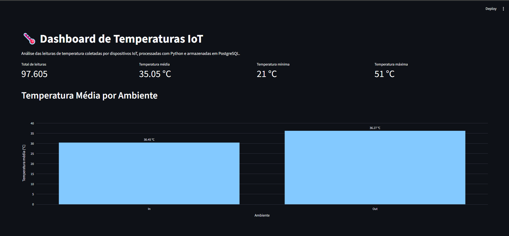
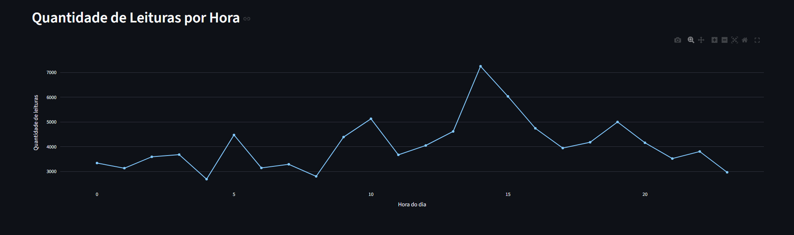
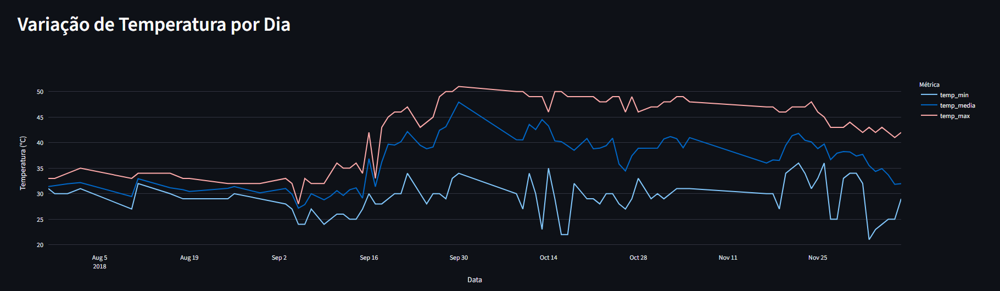

# Pipeline de Dados com IoT e Docker

Projeto desenvolvido para a disciplina **Disruptive Architectures: IoT, Big Data e IA**, com o objetivo de construir um pipeline de dados capaz de processar leituras de temperatura coletadas por dispositivos IoT, armazená-las em um banco de dados PostgreSQL e disponibilizar visualizações por meio de um dashboard interativo.

## Objetivo

O projeto utiliza dados reais de sensores de temperatura para demonstrar as principais etapas de um pipeline de dados:

1. Leitura dos dados de um arquivo CSV;
2. Tratamento e transformação dos dados utilizando Python e Pandas;
3. Armazenamento dos dados em PostgreSQL;
4. Execução do PostgreSQL em um container Docker;
5. Criação de views SQL para análise dos dados;
6. Construção de um dashboard interativo com Streamlit e Plotly.

## Tecnologias utilizadas

- Python
- Pandas
- SQLAlchemy
- PostgreSQL
- Docker
- Docker Compose
- Streamlit
- Plotly
- Git
- GitHub

## Dataset

Foi utilizado o dataset **Temperature Readings: IoT Devices**, disponibilizado no Kaggle.

Fonte:

https://www.kaggle.com/datasets/atulanandjha/temperature-readings-iot-devices

O conjunto de dados possui registros de temperatura coletados por dispositivos IoT em ambientes internos (`In`) e externos (`Out`).

Após o tratamento dos dados, foram inseridos **97.605 registros** no PostgreSQL.

O período analisado vai de **28/07/2018 a 08/12/2018**, com temperaturas entre **21 °C e 51 °C**.

## Estrutura do projeto

```text
pipeline-iot-docker/
│
├── data/
│   └── .gitkeep
│
├── docs/
│   └── screenshots/
│       ├── dashboard-geral.png
│       ├── leituras-por-hora.png
│       └── temperatura-por-dia.png
│
├── sql/
│   └── views.sql
│
├── src/
│   ├── pipeline.py
│   └── dashboard.py
│
├── .env.example
├── .gitignore
├── docker-compose.yml
├── README.md
└── requirements.txt
```

O arquivo CSV utilizado no projeto não é armazenado no repositório. Para executar o pipeline, o dataset deve ser obtido através do Kaggle e colocado no diretório `data`.

## Configuração do ambiente

### 1. Clonar o repositório

```bash
git clone https://github.com/medivalmad/pipeline-iot-docker.git
cd pipeline-iot-docker
```

### 2. Criar um ambiente virtual

```bash
python -m venv .venv
```

No Windows PowerShell:

```powershell
.\.venv\Scripts\Activate.ps1
```

### 3. Instalar as dependências

```bash
pip install -r requirements.txt
```

### 4. Configurar as variáveis de ambiente

Crie um arquivo `.env` na raiz do projeto com base no `.env.example`.

Exemplo:

```env
POSTGRES_USER=iot_user
POSTGRES_PASSWORD=sua_senha
POSTGRES_DB=iot_temperature
POSTGRES_HOST=localhost
POSTGRES_PORT=5432
```

O arquivo `.env` está configurado no `.gitignore` para evitar que credenciais sejam enviadas ao repositório.

## PostgreSQL com Docker

O PostgreSQL é executado em um container Docker configurado através do arquivo `docker-compose.yml`.

Para iniciar o banco:

```bash
docker compose up -d
```

Para verificar se o container está em execução:

```bash
docker ps
```

O banco utiliza um volume Docker para manter os dados persistentes mesmo após a interrupção do container.

## Executando o pipeline

Após baixar o dataset do Kaggle, coloque o arquivo:

```text
IOT-temp.csv
```

dentro da pasta:

```text
data/
```

Em seguida execute:

```bash
python src/pipeline.py
```

O pipeline realiza a leitura do CSV, tratamento dos dados, conversão das datas e inserção das informações na tabela `temperature_readings` do PostgreSQL.

## Views SQL

Foram criadas três views para facilitar a análise dos dados.

### 1. avg_temp_por_ambiente

Calcula a temperatura média de acordo com o tipo de ambiente:

- `In`: ambiente interno;
- `Out`: ambiente externo.

Essa view permite comparar as condições de temperatura registradas dentro e fora do ambiente monitorado.

No conjunto analisado, a temperatura média foi aproximadamente:

- **In:** 30,45 °C
- **Out:** 36,27 °C

### 2. leituras_por_hora

Agrupa os registros pela hora do dia e calcula a quantidade de leituras realizadas em cada horário.

Essa análise permite identificar como as medições estão distribuídas durante as 24 horas e verificar períodos com maior concentração de registros.

### 3. temp_por_dia

Agrupa os dados por data e calcula:

- temperatura mínima;
- temperatura média;
- temperatura máxima.

Essa view permite acompanhar a evolução e a variação diária das temperaturas durante todo o período analisado.

Para criar ou atualizar as views:

```powershell
Get-Content .\sql\views.sql | docker exec -i postgres-iot psql -U iot_user -d iot_temperature
```

## Dashboard

O dashboard foi desenvolvido utilizando **Streamlit** e **Plotly**.

Para executá-lo:

```bash
streamlit run src/dashboard.py
```

Depois, acesse no navegador o endereço exibido pelo Streamlit, normalmente `localhost:8501`.

O dashboard apresenta indicadores gerais e três visualizações principais.

### Temperatura média por ambiente



O gráfico permite comparar diretamente as temperaturas médias registradas em ambientes internos e externos.

### Quantidade de leituras por hora



A visualização apresenta a distribuição das leituras ao longo das 24 horas do dia.

### Variação de temperatura por dia



O gráfico apresenta as temperaturas mínima, média e máxima registradas diariamente.

## Principais resultados e insights

A análise dos dados mostrou que os ambientes externos apresentaram temperatura média superior aos ambientes internos.

A temperatura média geral do conjunto analisado foi de aproximadamente **35,05 °C**, enquanto os valores registrados variaram entre **21 °C e 51 °C**.

Também foi possível observar diferenças na quantidade de leituras realizadas ao longo das horas do dia e acompanhar a variação das temperaturas durante o período analisado.

Em um cenário real de IoT, análises desse tipo podem ser utilizadas para monitoramento ambiental, identificação de comportamentos anormais, geração de alertas e apoio à manutenção preditiva.

## Comandos Git utilizados

Durante o desenvolvimento foram utilizados comandos como:

```bash
git init
git status
git add .
git commit -m "chore: estrutura inicial do projeto"
git commit -m "feat: implementa pipeline IoT com PostgreSQL e dashboard"
git push
git pull
```

O Git foi utilizado para controle de versão do projeto e o GitHub para disponibilização do código-fonte e da documentação.

## Segurança

As credenciais do PostgreSQL não são armazenadas diretamente no código-fonte.

As configurações são carregadas através de variáveis de ambiente utilizando um arquivo `.env`, que não é versionado pelo Git.

O arquivo `.env.example` serve como modelo de configuração para quem desejar executar o projeto.

## Autor

**João Pedro Lemos de Oliveira**

Projeto acadêmico desenvolvido para a disciplina **Disruptive Architectures: IoT, Big Data e IA**.